# Beginner

1.What is the difference between a `StatelessWidget` and a `StatefulWidget` in Flutter?

Stateless Widget
A stateless widget can not change their state during the runtime of an app which means it can not redraw its self while the app is running. Stateless widgets are immutable.

Stateful Widget
A stateful widget can redraw itself multiple times, while the app is running which means its state is mutable. For example, when a button is pressed, the state of the widget is changed

---

2.What is the difference between `final` and `const` in Flutter?

`final` means single-assignment: A final variable or field must have an initializer. Once assigned a value, a final variable's value cannot be changed. final modifies variables.

`const` has a meaning that's a bit more complex and subtle in Dart. const modifies values. You can use it when creating collections, like const [1, 2, 3], and when constructing objects (instead of new) like const Point(2, 3). Here, const means that the object's entire deep state can be determined entirely at compile time and that the object will be frozen and completely immutable.

Const objects have a couple of interesting properties and restrictions:

They must be created from data that can be calculated at compile time. A const object does not have access to anything you would need to calculate at runtime. 1 + 2 is a valid const expression, but new DateTime.now() is not.

They are deeply, transitively immutable. If you have a final field containing a collection, that collection can still be mutable. If you have a const collection, everything in it must also be const, recursively.

They are canonicalized. This is sort of like string interning: for any given const value, a single const object will be created and re-used no matter how many times the const expression(s) are evaluated.

https://news.dartlang.org/2012/06/const-static-final-oh-my.html

---

3.Explain the `Stateful Widget Lifecycle`?

The lifecycle has the following simplified steps:
createState()
mounted == true
initState()
didChangeDependencies()
build()
didUpdateWidget()
setState()
deactivate()
dispose()
mounted == false

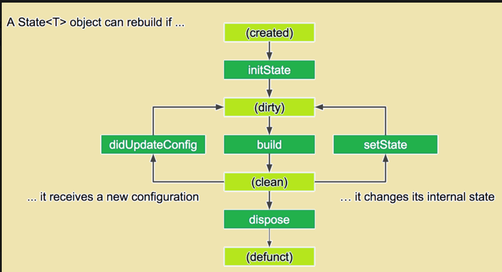

---

4.`SizedBox` VS `Container`?

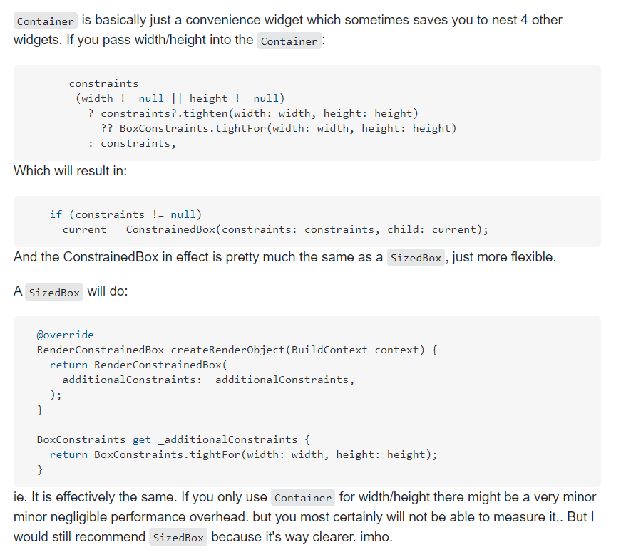

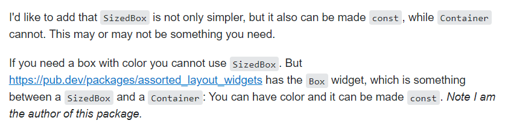

---

5.What is a `Spacer` widget?

Spacer manages the empty space between the widgets with flex container. Evenly with the Row and Column MainAxis alignment we can manage the space as well

---

6.What is the difference between `hot restart` and `hot reload`?

What is Hot Reload in Flutter:

Flutter hot reload features works with combination of Small r key on command prompt or Terminal. Hot reload feature quickly compile the newly added code in our file and sent the code to Dart Virtual Machine. After done updating the Code Dart Virtual Machine update the app UI with widgets. Hot Reload takes less time then Hot restart. There is also a draw back in Hot Reload, If you are using States in your application then Hot Reload preservers the States so they will not update on Hot Reload our set to their default values

What is Hot Restart in Flutter:

Hot restart is much different than hot reload. In Hot restart it destroys the preserves State value and set them to their default. So if you are using States value in your application then After every hot restart the developer gets fully compiled application and all the states will set to their defaults. The app widget tree is completely rebuilt with new typed code. Hot Restart takes much higher time than Hot reload

---

7.Why is the build() method on State and not StatefulWidget?

## 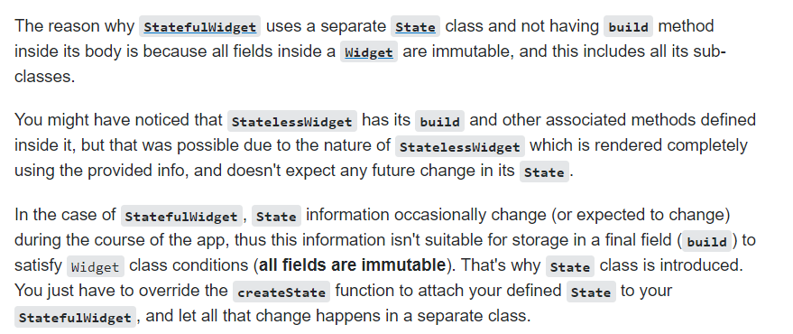

---

8.What is the purpose of a `SafeArea`?

SafeArea is basically a glorified Padding widget. If you wrap another widget with SafeArea, it adds any necessary padding needed to keep your widget from being blocked by the system status bar, notches, holes, rounded corners and other "creative" features by manufactures

---

8.Mention two or more operations that would require you to use or turn a `Future`

    1. Calling api using http
    2. Getting result from geolocator package
    3. With FutureBuilder widget

---

9.`Expanded` vs `Flexible`?

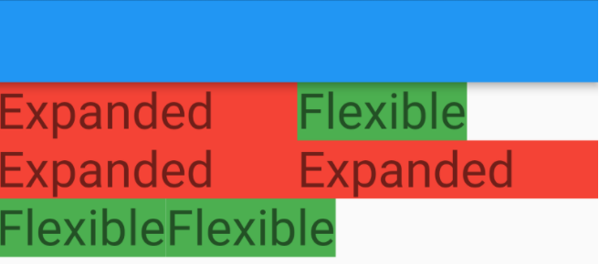

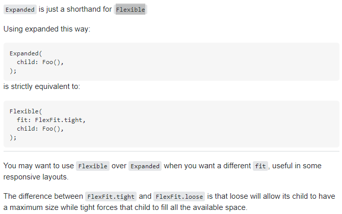

---

10.What is a `Navigator` and what are `Routes` in Flutter?

Navigation and routing are some of the core concepts of all mobile application, which allows the user to move between different pages. We know that every mobile application contains several screens for displaying different types of information. For example, an app can have a screen that contains various products. When the user taps on that product, immediately it will display detailed information about that product

---

11.When to use a `mainAxisSize`?

When you use MainAxisSize on your Column or Row, they will determine the size of the Column or Row along the main axis, i.e, height for Column and width for Row

https://itnext.io/flutter-mainaxissize-max-vs-min-d9095d8f7914

---

12.Can we use `Color` and `Decoration` property simultaneously in the Container?

No.
The color property is a shorthand for creating a BoxDecoration with a color field. If you are adding a box decoration, simply place the color on the BoxDecoration.

---

13.Difference between a `Navigator.pushNamed` and `Navigator.pushReplacementNamed`?

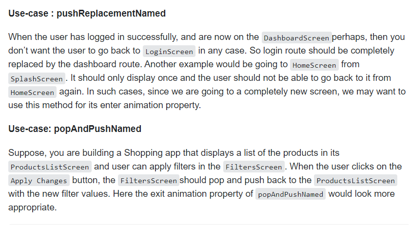

---

14.How to convert a `List` into a `Map` in Dart?

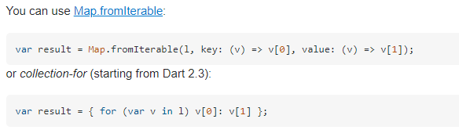

---

15.When can you use `double.INFINITY`?

When you want the widget to be big as the parent widget allow

---

# Intermediate

1.What is `Ticker`, `Tween` and `AnimationController`?

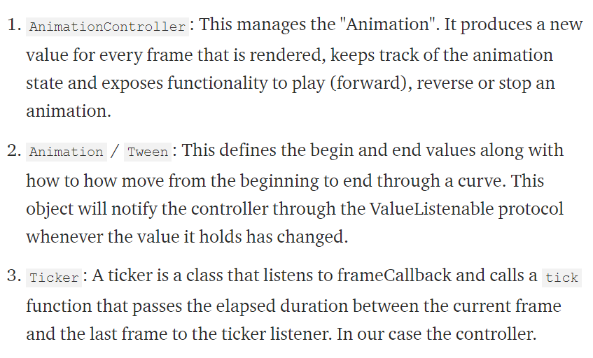

Animation Sequences
To achieve sequence animation we’ll introduce a new Widget that also helps with reducing animation code called AnimatedBuilder which allows you to rebuild your widget through a builder function every time a new animation value is calculated

---

2.What are the two types of `Streams` available in Flutter?

Single subscription streams:

It is a popular and common type of stream.
It consists of a series of events that are parts of a large whole. Here all events have to be delivered in a defined order without even missing a single event.
It is a type of stream that you get when you get a web request or receive a file.
This stream can only be listed once. Listing it, again and again, means missing initial values and overall stream makes no sense at all.
When the listing starts in this stream the data gets fetched and provided in chunks.

Broadcast streams:

This stream is meant for the individual messages that can be handled one at a time. These types of streams are commonly used for mouse events in a browser.
You can list this type of stream at any time.
Multiple listeners can listen at a time and also you have a chance to listen after the cancellation of the previous subscription

---

3.What is an `InheritedWidget`?

https://www.youtube.com/watch?v=Zbm3hjPjQMk

---

4.What is a `PageRoute`?

Allow us to add animation transaction to the route
https://github.com/divyanshub024/Flutter-route-transition

---

5.Explain `async`, `await` and `Future`?

Async means that this function is asynchronous and you might need to wait a bit to get its result.
Await literally means - wait here until this function is finished and you will get its return value.
Future is a type that ‘comes from the future’ and returns value from your asynchronous function. It can complete with success(.then) or with
an error(.catchError)

https://www.youtube.com/watch?v=SmTCmDMi4BY

---

6.How is Flutter native?

Flutter uses only the canvas of the native platform and draws the UI and all the components from scratch. All the UI elements look the same as native ones. This mainly reduces the burden of time for converting through some language to the native one and speeds up the UI rendering time. As a result, the UI performance is remarkably high

---

7.What is a `Stream`?

A stream is like a pipe, you put a value on the one end and if there’s a listener on the other end that listener will receive that value. A Stream can have multiple listeners and all of those listeners will receive the same value when it’s put in the pipeline. The way you put values on a stream is by using a StreamController

---

8.What are `keys` in Flutter and when should you use it?

You don't need to use Keys most of the time, the framework handles it for you and uses them internally to differentiate between widgets. There are a few cases where you may need to use them though.

A common case is if you need to differentiate between widgets by their keys, ObjectKey and ValueKey can be useful for defining how the widgets are differentiated

Another example is that if you have a child you want to access from a parent, you can make a GlobalKey in the parent and pass it to the child's constructor. Then you can do globalKey.state to get the child's state (say for example in a button press callback). Note that this shouldn't be used excessively as there are often better ways to get around it

https://www.youtube.com/watch?v=kn0EOS-ZiIc&feature=emb_title

---

9.When should you use mainAxisAlignment and crossAxisAlignment?

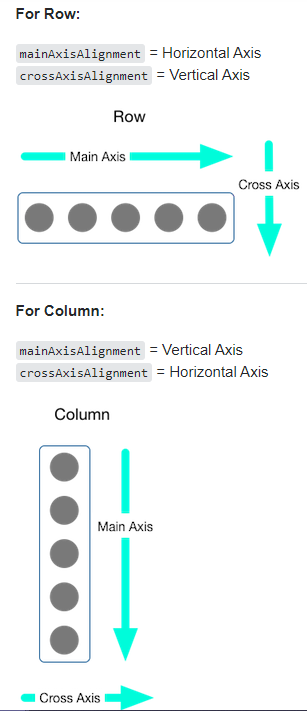

---

9.when should we use a `resizeToAvoidBottomInset`?

If true the body and the scaffold's floating widgets should size themselves to avoid the onscreen keyboard whose height is defined by the ambient MediaQuery's MediaQueryData.viewInsets bottom property.

For example, if there is an onscreen keyboard displayed above the scaffold, the body can be resized to avoid overlapping the keyboard, which prevents widgets inside the body from being obscured by the keyboard

`With resizeToAvoidBottomInset`
https://qiita-image-store.s3.ap-northeast-1.amazonaws.com/0/316760/7da984e6-ec32-7989-174c-0e104e4c5557.gif

`without resizeToAvoidBottomInset`
https://qiita-image-store.s3.ap-northeast-1.amazonaws.com/0/316760/0c933d45-82a2-4401-836c-d1c6f5abc2db.gif

---

10.What is the difference between `as`,`show` and `hide` in an import statement?

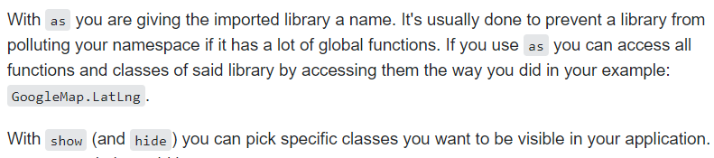

---

11.What is the importance of a `TextEditingController`?

Whenever the user modifies a text field with an associated TextEditingController, the text field updates value and the controller notifies its listeners. Listeners can then read the text and selection properties to learn what the user has typed or how the selection has been updated

---

12.How is an `Inherited Widget` different from a `Provider`?

Provider basically takes the logic of InheritedWidgets, but reduce the boilerplate to the strict minimum

---

13.What is an `UnmodifiableListView`?

Cannot change the list items by adding or removing

https://github.com/filiph/state_experiments/issues/5

---

14.Difference between these operators `??` and `?.`

`??`
expr1 ?? expr2
If expr1 is non-null, returns its value; otherwise, evaluates and returns the value of expr2.

`?.` Like . but the leftmost operand can be null; example: foo?.bar selects property bar from expression foo unless foo is null (in which case the value of foo?.bar is null)

https://dart.dev/guides/language/language-tour

---

# Expert

1.Difference between a Single Instance and Scoped Instance ?

https://codewithandrea.com/articles/2019-06-10-global-access-vs-scoped-access/

2.Difference between getDocuments() vs snapshots() in Firestore?

3.What is a `vsync`?

Vsync basically keeps the track of screen, so that Flutter does not renders the animation when the screen is not being displayed

4.Difference between `AnimationController` and `Animation`?

AnimationController is for how long the animation would be and how to control from time, upper and lower boundary, how to control data with time, length, sequence, etc. while AnimationTween is for the range of animation with time, colour, range, sequence, etc as long the animation would be while

5.When do you use the `WidgetsBindingObserver`?

To check when the system puts the app in the background or returns the app to the foreground

6.What do you know about Dart `Isolates`?

To gain concurrency Dart makes use of the Isolates method which works on its own without sharing memory but uses passing or message communication.

7.`Stream` vs `Future`?

The difference is that Futures are about one-shot request/response (I ask, there is a delay, I get a notification that my Future is ready to collect, and I'm done!) whereas Streams are a continuous series of responses to a single request (I ask, there is a delay, then I keep getting responses until the stream dries up or I decide to close it and walk away)

8.What's the difference between `async` and `async*` in Dart?

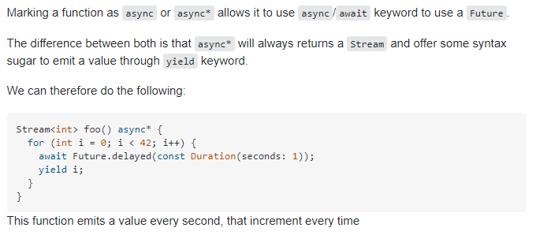

9.What does `non-nullable` by default mean?

10.Why is `exit(0)` not preferred for closing an app?

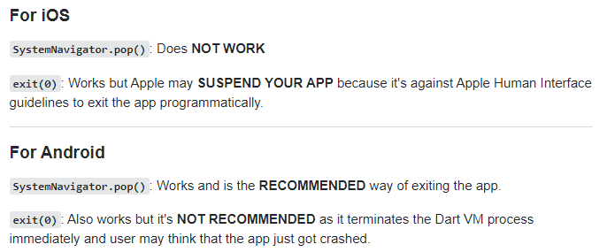

11.What are generators in flutter?

In Dart, a generator is a unique function that allows the user to produce a value sequence easily. Generators return values on demand when we try to iterate over them.
